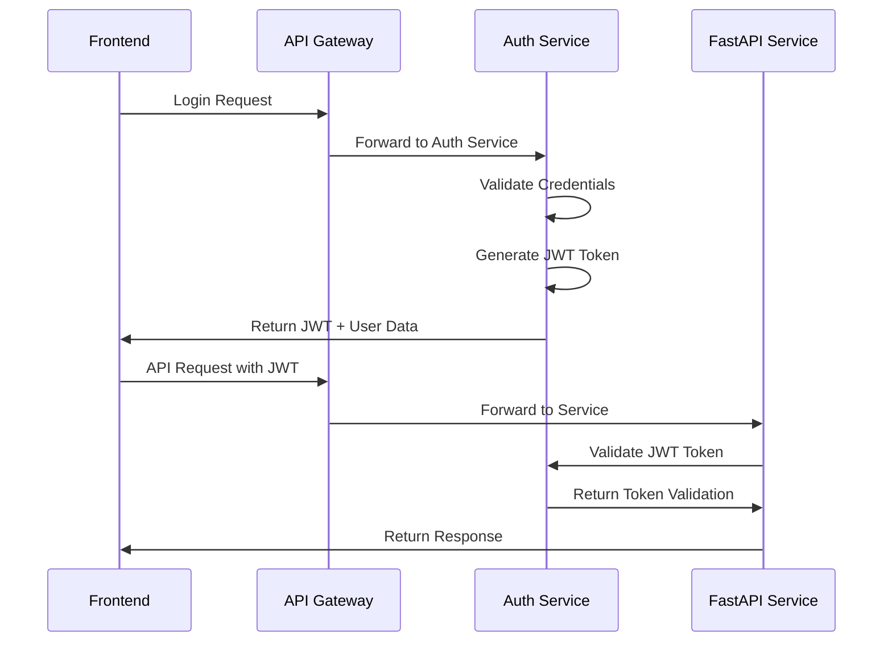

# WEMS Microservices Architecture Migration Plan

## 🏗️ System Architecture Overview

### Current State Analysis
- **Dual Layout System**: Admin Layout (`/admin/*`) and User Layout (`/user/*`) with role-based routing
- **Authentication**: JWT + Session-based with role-based access control
- **User Roles**: Master Admin, Super Admin, Board Admin, Admin, Madrasha
- **Frontend**: Vue 3 + TypeScript + PrimeVue + Tailwind CSS
- **Backend**: Django 5.2.5 with PostgreSQL, custom authentication

### Target Microservices Architecture

```
┌─────────────────────────────────────────────────────────────────┐
│                    API Gateway (Nginx/Traefik)                 │
│              ┌─────────────────────────────────────┐          │
│              │     Single Frontend (Vue.js)        │          │
│              │  - Admin Layout (/admin/*)           │          │
│              │  - User Layout (/user/*)             │          │
│              └─────────────────────────────────────┘          │
└─────────────────────────────────────────────────────────────────┘
                              │
                    ┌─────────┴─────────┐
                    │                   │
        ┌───────────▼───────────┐       │
        │   Central Auth Service │       │
        │     (Django)          │       │
        │  - Authentication     │       │
        │  - Authorization      │       │
        │  - User Management    │       │
        │  - JWT Token Issuing  │       │
        └───────────┬───────────┘       │
                    │                   │
        ┌───────────┼───────────┐       │
        │           │           │       │
┌───────▼────┐ ┌───▼────┐ ┌────▼────┐ ┌──▼─────┐ ┌─────────┐
│   FastAPI   │ │FastAPI │ │ FastAPI │ │FastAPI │ │ FastAPI │
│   Accounts  │ │ Taleem │ │  Sanad  │ │Training│ │   Exam  │
│   Service   │ │Service │ │ Service │ │Service │ │ Service │
└─────────────┘ └────────┘ └─────────┘ └────────┘ └─────────┘
        │           │           │           │           │
        └───────────┼───────────┼───────────┼───────────┘
                    │           │           │
            ┌───────▼───────────▼───────────▼───────┐
            │     Shared Database (PostgreSQL)    │
            └─────────────────────────────────────┘
```

## 🔐 Authentication Flow

### 1. Central Authentication Service (Django)
- **Purpose**: Handle all authentication, authorization, and user management
- **Technology**: Django (existing authentication logic)
- **Port**: 8000
- **Responsibilities**:
  - User login/logout
  - JWT token generation and validation
  - User role management
  - Permission checking
  - Session management

### 2. Service Authentication
All FastAPI services will validate JWT tokens through the Central Auth Service



## 🏢 Service Breakdown

### 1. Central Auth Service (Django)
**Port**: 8000
**Database**: PostgreSQL (shared)
**Responsibilities**:
- User authentication (email/phone login)
- JWT token management
- User role and permission management
- Session management
- Profile management

**API Endpoints**:
```
POST /auth/login/
POST /auth/logout/
POST /auth/refresh/
GET  /auth/profile/
POST /auth/validate-token/
GET  /auth/users/
POST /auth/users/
PUT  /auth/users/{id}/
DELETE /auth/users/{id}/
```

### 2. Accounts Service (FastAPI)
**Port**: 8001
**Database**: PostgreSQL (shared)
**Responsibilities**:
- Financial accounting
- Voucher management
- Payment processing
- Financial reporting

**API Endpoints**:
```
GET    /api/accounts/vouchers/
POST   /api/accounts/vouchers/
PUT    /api/accounts/vouchers/{id}/
GET    /api/accounts/payments/
POST   /api/accounts/payments/
GET    /api/accounts/reports/
```

### 3. Taleem Tarbiyat Service (FastAPI)
**Port**: 8002
**Database**: PostgreSQL (shared)
**Responsibilities**:
- Educational curriculum management
- Student progress tracking
- Teacher assignments
- Class scheduling

**API Endpoints**:
```
GET    /api/taleem/subjects/
POST   /api/taleem/subjects/
GET    /api/taleem/classes/
POST   /api/taleem/classes/
GET    /api/taleem/progress/
```

### 4. Certificate (Sanad) Service (FastAPI)
**Port**: 8003
**Database**: PostgreSQL (shared)
**Responsibilities**:
- Certificate generation
- Sanad management
- Certificate verification
- Document templates

**API Endpoints**:
```
GET    /api/sanad/certificates/
POST   /api/sanad/certificates/
GET    /api/sanad/templates/
POST   /api/sanad/templates/
GET    /api/sanad/verify/{certificate_id}
```

### 5. Registration Service (FastAPI)
**Port**: 8004
**Database**: PostgreSQL (shared)
**Responsibilities**:
- Student registration
- Registration verification
- Registration reports
- Old student management

**API Endpoints**:
```
GET    /api/registration/students/
POST   /api/registration/students/
GET    /api/registration/overview/
GET    /api/registration/old-students/
POST   /api/registration/old-students/
```

### 6. Administration Service (FastAPI)
**Port**: 8005
**Database**: PostgreSQL (shared)
**Responsibilities**:
- User management
- System settings
- Madrasha management
- Marhala setup

**API Endpoints**:
```
GET    /api/admin/users/
POST   /api/admin/users/
GET    /api/admin/madrashas/
POST   /api/admin/madrashas/
GET    /api/admin/marhalas/
POST   /api/admin/marhalas/
```

### 7. Training Service (FastAPI)
**Port**: 8006
**Database**: PostgreSQL (shared)
**Responsibilities**:
- Training program management
- Teacher training
- Training materials
- Training certificates

**API Endpoints**:
```
GET    /api/training/programs/
POST   /api/training/programs/
GET    /api/training/materials/
POST   /api/training/materials/
```

### 8. Publication Service (FastAPI)
**Port**: 8007
**Database**: PostgreSQL (shared)
**Responsibilities**:
- Book management
- Publication tracking
- Library management
- Content distribution

**API Endpoints**:
```
GET    /api/publications/books/
POST   /api/publications/books/
GET    /api/publications/library/
POST   /api/publications/library/
```

### 9. Exam Management Service (Existing Django)
**Port**: 8008
**Database**: PostgreSQL (shared)
**Responsibilities**:
- Exam setup and management
- Fee management
- Exam scheduling
- Result processing

## 🌐 Frontend Integration Strategy

### API Gateway Configuration (Nginx)
```nginx
upstream auth_service {
    server localhost:8000;
}

upstream accounts_service {
    server localhost:8001;
}

upstream taleem_service {
    server localhost:8002;
}

# ... other services

server {
    listen 80;
    server_name localhost;

    # Frontend
    location / {
        root /path/to/wems-frontend/dist;
        try_files $uri $uri/ /index.html;
    }

    # Auth Service
    location /auth/ {
        proxy_pass http://auth_service;
        proxy_set_header Host $host;
        proxy_set_header X-Real-IP $remote_addr;
    }

    # Accounts Service
    location /api/accounts/ {
        proxy_pass http://accounts_service;
        proxy_set_header Host $host;
        proxy_set_header X-Real-IP $remote_addr;
        proxy_set_header Authorization $http_authorization;
    }

    # ... other service routes
}
```

### Frontend Service Client
Create a unified API client that handles authentication and service routing:

```typescript
// services/apiClient.ts
class ApiClient {
  private baseURL = process.env.VUE_APP_API_BASE_URL;

  async request(endpoint: string, options: RequestInit = {}) {
    const token = localStorage.getItem('token');

    const response = await fetch(`${this.baseURL}${endpoint}`, {
      ...options,
      headers: {
        'Content-Type': 'application/json',
        'Authorization': `Bearer ${token}`,
        ...options.headers,
      },
    });

    if (response.status === 401) {
      // Redirect to login
      window.location.href = '/signin';
    }

    return response.json();
  }

  // Service-specific methods
  accounts = {
    getVouchers: () => this.request('/api/accounts/vouchers/'),
    createVoucher: (data: any) => this.request('/api/accounts/vouchers/', {
      method: 'POST',
      body: JSON.stringify(data),
    }),
  };

  taleem = {
    getSubjects: () => this.request('/api/taleem/subjects/'),
    createSubject: (data: any) => this.request('/api/taleem/subjects/', {
      method: 'POST',
      body: JSON.stringify(data),
    }),
  };

  // ... other services
}
```

## 🔄 Layout System Integration

### Admin Layout Routes
```typescript
// Admin routes will be handled by different services
const adminRoutes = [
  {
    path: '/admin/dashboard',
    component: () => import('@/views/Pages/Admin/dashboard/AdminDashboard.vue'),
    meta: { service: 'auth', endpoint: '/admin/dashboard' }
  },
  {
    path: '/admin/accounts/vouchers',
    component: () => import('@/views/Pages/Admin/accounts/VoucherList.vue'),
    meta: { service: 'accounts', endpoint: '/api/accounts/vouchers/' }
  },
  {
    path: '/admin/taleem/subjects',
    component: () => import('@/views/Pages/Admin/taleem/SubjectList.vue'),
    meta: { service: 'taleem', endpoint: '/api/taleem/subjects/' }
  },
  // ... other admin routes
];
```

### User Layout Routes
```typescript
// User routes will be handled by different services
const userRoutes = [
  {
    path: '/user/dashboard',
    component: () => import('@/views/Ecommerce.vue'),
    meta: { service: 'auth', endpoint: '/user/dashboard' }
  },
  {
    path: '/user/registration/overview',
    component: () => import('@/views/Pages/registraion/registrationOverview.vue'),
    meta: { service: 'registration', endpoint: '/api/registration/overview/' }
  },
  {
    path: '/user/markaz/list',
    component: () => import('@/views/Pages/markaz/MarkazList.vue'),
    meta: { service: 'markaz', endpoint: '/api/markaz/list/' }
  },
  // ... other user routes
];
```

## 🚀 Migration Strategy

### Phase 1: Infrastructure Setup
1. Set up API Gateway (Nginx)
2. Create Central Auth Service (extract existing auth logic)
3. Set up FastAPI service templates
4. Configure shared database access

### Phase 2: Service Migration
1. Migrate Accounts module to FastAPI service
2. Migrate Registration module to FastAPI service
3. Migrate Administration module to FastAPI service
4. Update frontend to use new service endpoints

### Phase 3: Additional Services
1. Create Taleem Tarbiyat service
2. Create Certificate (Sanad) service
3. Create Training service
4. Create Publication service

### Phase 4: Optimization
1. Add service discovery
2. Implement distributed logging
3. Add monitoring and alerting
4. Performance optimization

## 🔧 Development Environment

### Docker Compose Setup
```yaml
version: '3.8'
services:
  nginx:
    image: nginx:alpine
    ports:
      - "80:80"
    volumes:
      - ./nginx.conf:/etc/nginx/nginx.conf
    depends_on:
      - auth-service
      - accounts-service
      - taleem-service

  auth-service:
    build: ./services/auth-service
    ports:
      - "8000:8000"
    environment:
      - DATABASE_URL=postgresql://postgres:password@db:5432/wems
    depends_on:
      - db

  accounts-service:
    build: ./services/accounts-service
    ports:
      - "8001:8001"
    environment:
      - DATABASE_URL=postgresql://postgres:password@db:5432/wems
      - AUTH_SERVICE_URL=http://auth-service:8000
    depends_on:
      - db
      - auth-service

  # ... other services

  db:
    image: postgres:13
    environment:
      - POSTGRES_DB=wems
      - POSTGRES_USER=postgres
      - POSTGRES_PASSWORD=password
    volumes:
      - postgres_data:/var/lib/postgresql/data

volumes:
  postgres_data:
```

This architecture maintains your existing dual-layout system while enabling microservices scalability. The Central Auth Service preserves all your current authentication logic, ensuring no disruption to existing users and roles.